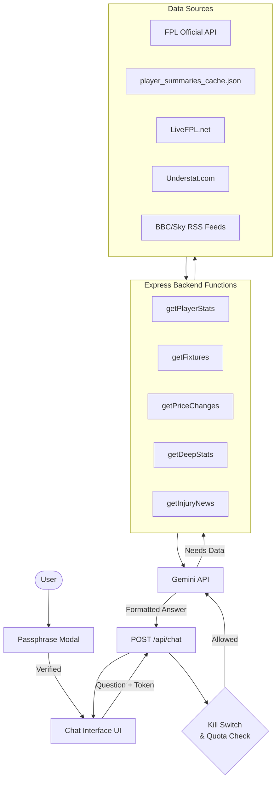

# FPL AI Chat Assistant: Architecture Design

This document outlines the proposed architecture for adding an interactive, AI-powered chat assistant to the FPL-Team-Builder app, with secure access control, cost safeguards, and extended data capabilities.

---

## 1. High-Level Architecture

Adding this feature requires introducing a few new components to your existing stack:

*   **Frontend (React):** An **omnipresent, floating Chat Widget** (like a chat bubble in the corner) that is decoupled from the main dashboard. It is gated behind a passphrase modal but **does not require the user to enter a Team ID** to use.
*   **Backend (Express):** A new secure endpoint (`POST /api/chat`) that validates the passphrase, manages usage limits, and orchestrates AI calls.
*   **AI Layer:** Google Gemini API, using **Function Calling** to invoke FPL data tools defined on your Express server.



---

## 2. Strategic Decision: MCP Server vs. In-App Backend

> [!IMPORTANT]
> **Strategic Decision:** We will **not** invest any further development effort into extending the capabilities of the MCP server. 
> 
> The MCP server is strictly a development utility that allows the IDE assistant to answer FPL questions during coding sessions. It does **NOT** plug directly into the web app's chat feature, and any effort spent extending it would be wasted on a third-party tool rather than the product itself.

**The Plan Moving Forward:**
Instead of modifying the MCP server, we will build equivalent (and more powerful) data-fetching logic as **native Express backend functions**. These backend functions serve double duty: they power the production UI chat *and* make the app's internal API richer for actual users.

| Feature Details | Local MCP Server (As-Is) | In-App Backend Functions (To Build) |
|---|---|---|
| **Who calls it?** | The IDE AI assistant (Antigravity) | Gemini API via your Express server |
| **Where does it live?** | Your local machine / IDE config | Your native Express `server.ts` |
| **Development Focus** | 🛑 None. Leave as a free local bonus. | 🟢 High. All effort goes here. |
| **Used in production?**| ❌ No | ✅ Yes |

**The underlying FPL data remains identical** — you are just writing your own version of those fetching functions inside your existing Express backend, leveraging the logic already present in `useFPLData.ts` and `metrics.ts`.

---

## 3. Access Control: Passphrase Authentication

Access to the chat feature is gated behind a **required passphrase** system — not optional.

### How it works:
1.  When a user clicks the Chat tab, a **padlock modal** appears asking for the passphrase.
2.  The user enters the passphrase you've privately shared with them (stored in `.env` as `CHAT_ACCESS_PASSPHRASE`).
3.  The frontend sends the passphrase to a lightweight verification endpoint (`POST /api/chat/verify`).
4.  On success, the backend returns a signed **session token** (a simple HMAC hash), which is stored in `localStorage`.
5.  Every subsequent chat request sends this token in the request header. The backend validates it before touching the Gemini API.
6.  The token expires after 7 days, requiring the user to re-enter the passphrase.

### Security properties:
*   The actual passphrase never lives in the frontend code or browser state — only the derived token does.
*   Tokens cannot be forged without knowing the server's secret signing key.
*   Revoking access is instant: changing `CHAT_ACCESS_PASSPHRASE` in `.env` and redeploying invalidates all existing tokens.

### Decoupled Team ID Logic:
*   The chat widget renders on the landing page immediately.
*   Users can ask general stats questions (e.g., *"Who has high xG?"*) without ever loading their FPL team.
*   If the user *has* loaded an FPL Team ID into the main app state, the chat passes that ID to the backend as context, allowing the AI to answer personalized squad questions (e.g., *"Should I bench Saka?"*).

### New environment variables needed:
```
CHAT_ACCESS_PASSPHRASE=your-secret-phrase
CHAT_TOKEN_SECRET=a-random-signing-key
```

---

## 4. The AI Integration (Gemini Function Calling)

When a user asks a question, Gemini doesn't answer from its own training data alone. It uses **Function Calling** to request live data from your server before composing an answer.

**Example flow for:** *"Which midfielders are best expected to score the most points over the next 3 games?"*

1.  Gemini receives the question + a list of available tool definitions.
2.  Gemini pauses and responds: *"I need to call `getPlayerStats` with `{ position: 'MID' }` and `getFixtures` with `{ games: 3 }`."*
3.  Your Express server runs those local functions, fetches the data, and returns the results to Gemini.
4.  Gemini formats an intelligent, conversational answer using the real data.

### Backend tool functions to implement:

| Function | Data Source | Answers questions about |
|---|---|---|
| `getPlayerStats({ position, maxCost, minForm })` | FPL Official API / Cache | Player rankings, form, ownership |
| `getUpcomingFixtures({ teamId, games })` | FPL Official API | Fixture difficulty, schedule |
| `analyzePlayer({ playerName })` | FPL Official API / Cache | Deep player profile, PP90, reliability |
| `getPriceChanges()` | LiveFPL.net | Who is rising/falling in price |
| `getDeepStats({ playerName, split })` | Understat.com + Cache | xG/xA splits, home/away breakdowns |
| `getInjuryNews({ teamName })` | BBC/Sky RSS Feeds | Latest injury and team news |

---

## 5. Extending Capabilities Beyond FPL MCP Blind Spots

The standard FPL API has known gaps. Here's how we close them:

### Gap 1: Price Change Predictions
*   **Problem:** Official FPL data doesn't predict price rises.
*   **Solution:** A `getPriceChanges()` function that fetches and caches data from **LiveFPL.net** (which aggregates transfer activity to predict price movements). Cache refreshes every 2 hours.
*   **Effort:** Low-Medium.

### Gap 2: Deep Underlying Stats (xG/xA splits)
*   **Problem:** FPL API only provides season-long xG/xA totals — no home/away or last-N-game splits.
*   **Solution (short term):** Extend `player_summaries_cache.json` to pre-compute granular splits (last 5 home games, away form, etc.) at cache build time. The AI queries your cache directly.
*   **Solution (long term):** Add an **Understat.com** data fetcher for match-level stats.
*   **Effort:** Medium (cache extension is lower effort and already partially supported).

### Gap 3: Injury & Team News
*   **Problem:** Official flags give percentages but no narrative context.
*   **Solution (MVP):** Use the existing `chance_of_playing_next_round` field already in the FPL API. The AI can say *"Saka is flagged at 75% chance of playing."*
*   **Solution (enhanced):** Add a `getInjuryNews()` function that pulls and parses **BBC Sport / Sky Sports RSS feeds** for the latest press conference summaries, cached daily.
*   **Effort:** Low for MVP flags; Medium for RSS integration.

> [!TIP]
> **Recommended build order:** Start with the core FPL API tools (Phase 1), ship, then bolt on `getPriceChanges()` and extended cache stats in Phase 2. This avoids overcomplicating the first launch.

---

## 6. Cost Management & Kill Switches

Three layered safeguards ensure you can never be accidentally charged:

### Layer 1: Manual Kill Switch (`.env` flag)
*   `ENABLE_AI_CHAT=true/false` in `.env`.
*   If `false`: the backend endpoint rejects all requests with `403 Forbidden`; the frontend removes the chat tab from the DOM entirely.
*   Flip it off any time you want, take effect on next deploy.

### Layer 2: Automatic Free-Tier Hard Ceiling
*   By keeping your Google AI Studio API key on the **unpaid tier** (no billing attached), you physically cannot be charged.
*   Google returns `429 Too Many Requests` if the 1,500 daily limit is exceeded.
*   The frontend catches `429` errors gracefully and displays: *"We've hit our free AI limit for today — check back tomorrow!"* instead of crashing.

### Layer 3: Internal Soft Limit Counter (Optional but Recommended)
*   A rolling daily counter in `server.ts` increments on every `/api/chat` request.
*   If the counter exceeds a soft threshold (e.g., **1,400 requests**), the server automatically flips the internal kill switch before Google's hard limit is hit.
*   Counter resets at midnight UTC.

---

## 7. Required Tech Stack Additions

| Package | Purpose |
|---|---|
| `@google/genai` | Backend SDK for calling Gemini API with function calling |
| Custom CSS | Chat bubble UI (no extra library needed) |
| `node-fetch` / `axios` | Fetching LiveFPL, Understat, and RSS feed data |
| **Environment Variables** | `GEMINI_API_KEY`, `CHAT_ACCESS_PASSPHRASE`, `CHAT_TOKEN_SECRET`, `ENABLE_AI_CHAT` |

---

## 8. Phased Build Plan

| Phase | Scope | Effort |
|---|---|---|
| **Phase 1 (MVP)** | Passphrase auth, kill switch, basic FPL tools (player stats, fixtures, player analysis), cost guards | ~2–3 hrs |
| **Phase 2 (Extended)** | Price change predictions (LiveFPL), deeper cache stats | ~2 hrs |
| **Phase 3 (Full)** | Understat integration, injury RSS feeds, conversation history | ~3–4 hrs |
